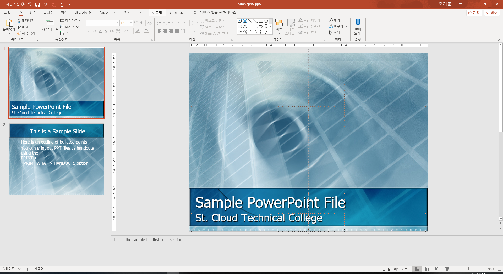
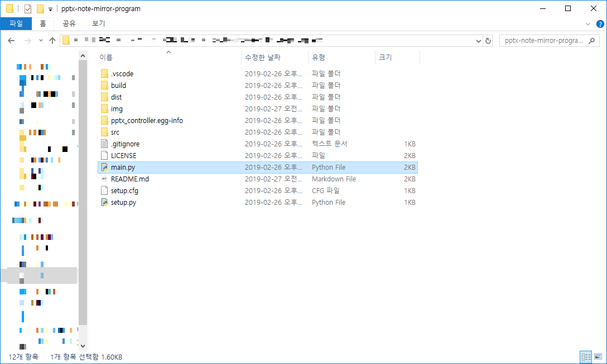
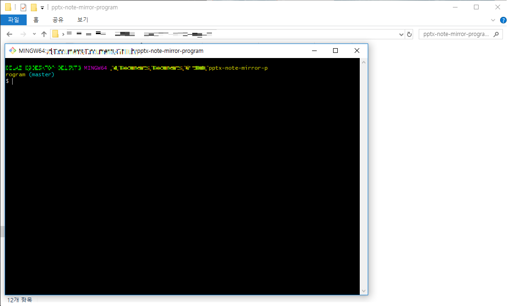

# PowerPoint remote program

## Description

Programs that can control PowerPoint over the network and mirror to client the presentation note.

## Requirements

### Environments

- Python version >= 3.0
- Server
  - OS: Windows 10
  - Server must have over PowerPoint 2016
- Client
  - OS: Don't care
  - Client must support over python 3.0

### Packages

- Tkinter: To show the script(or note) to client with GUI.
- logging: To show the error message.
- pywin32(or win32com): To control the MS PowerPoint.
- pynput: To check the input with real time.
- re: To check the valid IP or port number.
- socket: To communicate the server and client.
- json: To send data in a certain format.
- optparse: To give the program options.

## How to use

Before you use the program, you prepare the program which specify in "Requirements" sections.(pip must be compatible with python 3)

```text
pip install pywin32
pip install pynput
```

### Server

Next, you prepare the server computer which installed PowerPoint and open the one presentations like below.



Then, you open a folder which downloaded and have 'main.py' file



In that position open the terminal.



And the type like the below.(If your 'python' command version is 2.7 then you type the 'python3')

```text
python ./main.py --server -i (your IP) -p (your port)
```

So now, your server binds the (your IP):(your port). Howerever, if you are really laziest person, type the `python ./main.py --server`. In this case, it will automatically find your IP and bind default port. In other words, this means your server bind to (your IP):65500.(65500 is the default my program port)

Now it will make to start the *sildeshow* in PowerPoint.

### Client

Client also open a folder and open the terminal in that folder. And just type like the below.

```text
python ./main.py --client -i (server IP) -p (server port)
```

And if server socket is opened, you can now access the server's PowerPoint *slideshow* and have a control of it. Below table describes how to control server *slideshow*.

| command | description |
|:-------:|:------------|
| left arrow (←) | move the *slideshow* to left slide |
| right arrow (→) | move the *slideshow* to right slide |

If you want to more about specific options, type like below.

```text
python ./main.py --help
```

## Demo

